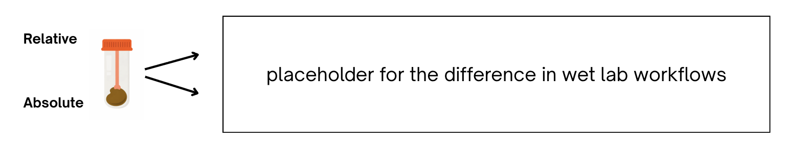

# Relative-Absolute-Microbial-Abundances

## Introduction

The gut microbiome is the ecosystem of microbes that exist in our digestive system, and analyzing the microbial composition as well as its functions can provide valuable insight to an individual’s health. Research has found strong connections between the gut microbiome with Inflammatory Bowel Disease, Parkinson’s, Alzheimer’s, and autism spectrum disorder. Most existing microbiome datasets contain only relative abundances because absolute quantification methods are expensive and harder to obtain. Our goal is to test whether we can predict total microbial load from relative abundances and use that estimate to approximate absolute taxon abundances.

  

## Data

- Metadata: limited per sample host information, such as age, body mass index, sex, etc.
- The dataset is comprised of paired feature tables: relative and absolute (short read with spike in) metagenomic abundances. Each followed a Sample (rows) x Feature (columns) structure.
    1. Both tables underwent MIcrobiome COVerage (micov) filtering at a 30% threshold
    2. The relative abundances hold integer values representing read counts, and could be divided by per-sample total read counts to yield the compositional form, where the per-sample sum across all features is always 1.
    3. The absolute abundances hold floating point values representing the best estimate of the actual quantity of microbes per unit of sample.

## Objectives

In exploring the differences between relative and absolute microbial abundances, our project’s objectives come in three folds:

1. use differential abundance techniques (ANCOM-BC and BIRDMAn) to identify shared biological signals and specify distinctions between the methods,
2. build baseline supervised machine learning models that can predict host metadata variables like age, body mass index (BMI), stool quality (Bristol Stool Scale), and related phenotypes,
3. and model absolute abundance using relative abundance data, producing synthetic absolute abundance datasets.

Once we develop the relative → absolute abundance model, we would conduct further analysis to compare the performance of true versus predicted absolute abundance tables. This includes attempting to reproduce the results in parts a) and b) of the project.

## Methods

### Differential Abundance Testing
In the first goal of our project, we perform differential abundance analysis to find taxa that are enriched or depleted across host phenotype groups. ANCOM-BC is employed to model feature abundances on the chosen metadata variables and to compute genus-level log fold changes, providing an interpretable analysis of how the microbiome changes from group to group.

Initially, the feature table and host metadata are cleaned of blanks and controls, sample identifiers are matched, and critical covariates (age, BMI, sex, and bowel movement type) are kept. For better interpretability and stability we remove implausible values and discretize both age and BMI into ranges to allow for clearer within group (bin-level) comparions. Next, a multifactor ANCOM-BC model with explicit reference levels is fitted, log fold-changes and significance values are exported, effects are aggregated at the genus level and the most prominent genus-level effects per phenotype group are visualized in the heatmaps below.

Lastly, we reapply the identical ANCOM-BC pipeline to the two held-out test absolute abundance tables, generated absolute counts and true absolute counts, to assess signal preservation, i.e., whether predicted absolute profiles recover similar differential abundance patterns (effect directions and relative magnitudes) to ground-truth measurements under the same model and pre-processing.

  

### Predictive Modeling

### Modeling Absolute from Relative Abundance

In the third goal of our project, we aim to model absolute abundances using only relative abundance data. As aforementioned, relative abundance tables are methodologically easier and less costly to curate due to inherent sample collection and sequencing procedures. However, this data is limited by its compositional nature, as relative abundance values estimate a proportion of the taxon compared to the population. However, while it is simple to find relative from absolute—just divide each value by the total count per sample—it has been difficult to do the opposite. Thus, it would be valuable to generate absolute counts from relative data, which estimate the exact quantity of the organism within a sample.

The model takes in relative abundance data as inputs, which is used to predict the total absolute counts summed across a sample. After finding the ‘total,’ that value can be multiplied by the proportions of relative abundance to synthesize the predicted absolute counts. Since the totals can vary largely in magnitude, from 10e4 to 10e13, we apply log(1+x) transformations on the prediction targets. We experimented with various linear, random forest, and gradient boosting regressions to achieve this goal.

  

## Results

### Differential Abundance Testing

### Predictive Modeling

### Modeling Absolute from Relative Abundance

  

## Discussion

## References
