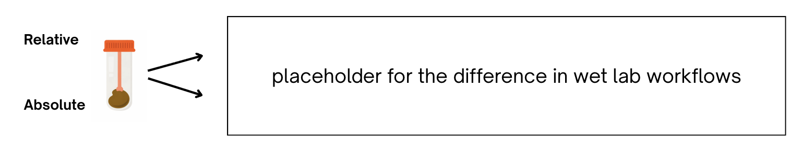
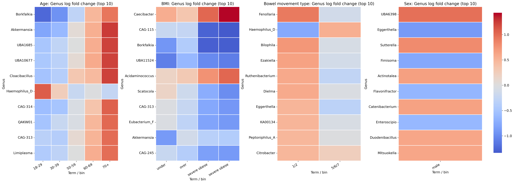

  <a class="header-btn" href="https://github.com/mwdai049/Microbial-Abundances-Predictions-on-EHR-and-Transformability" target="_blank">View Code</a>
  <a class="header-btn" href="https://drive.google.com/file/d/13E0J8UGHHeai270ouIiKM89FnBLRY9Mr/view" target="_blank">View Report</a>
  <a class="header-btn" href="https://drive.google.com/file/d/1TQLrf4RslSd6163AeN5YSy-KB23-aMVj/view" target="_blank">View Poster</a>

<a href="#problem">Problem</a>
<a href="#data">Data</a>
<a href="#method">Method</a>
<a href="#results">Results</a>
<a href="#discussion">Discussion</a>
<a href="#references">References</a>

## Problem

The gut microbiome plays an important role in human health, and microbial composition has been linked to conditions such as inflammatory bowel disease, Parkinson’s disease, Alzheimer’s disease, and autism spectrum disorder.

However, most microbiome datasets contain only **relative abundances**, since absolute quantification is more expensive and harder to obtain. Relative abundance data is useful, but it is compositional, meaning each feature is measured as a proportion of the total rather than a direct quantity.

Our project asks whether we can:

1. recover meaningful biological signals from relative and absolute abundance data,
2. compare how well each representation supports downstream prediction tasks, and
3. use relative abundance data to estimate total microbial load and generate **synthetic absolute abundance tables**.

  

---

## Data

Our dataset contains paired microbiome feature tables and limited host metadata.

### Inputs
- **Metadata:** age, body mass index (BMI), sex, bowel movement type, and related host variables
- **Relative abundance table:** sample-by-feature table based on sequencing-derived counts
- **Absolute abundance table:** sample-by-feature table estimating true microbial quantity per unit sample

### Preprocessing
- Both tables were filtered using **Microbiome Coverage (micov)** at a 30% threshold
- Samples, metadata, and feature tables were aligned by sample ID
- Blanks and controls were removed
- Key metadata variables were cleaned before analysis

### Why this matters
Relative abundance data is much easier to collect, but absolute abundance better reflects the true quantity of microbes. This project evaluates whether relative abundance can be used to recover similar biological conclusions and approximate absolute measurements.

---

## Method

Our methodology consists of three major components.

---

### 1. Differential Abundance Analysis

We use **ANCOM-BC** to identify taxa that are enriched or depleted across host phenotype groups. This allows us to compare biological signals across abundance representations.

Our workflow:
- clean metadata and feature tables
- match sample IDs
- retain important covariates such as age, BMI, sex, and bowel movement type
- remove implausible values
- discretize age and BMI into bins for clearer interpretation
- fit multifactor ANCOM-BC models with explicit reference levels
- summarize significant genus-level effects
- visualize results with heatmaps

To assess **signal preservation**, we apply the same pipeline to:
- true held-out absolute abundance tables
- predicted absolute abundance tables

This lets us evaluate whether synthetic absolute profiles recover similar effect directions and relative magnitudes.

  

### 2. Predictive Modeling

We build baseline supervised learning models to predict host metadata variables from microbiome features, including:
- age
- body mass index (BMI)
- sex
- bowel movement (stool quality)

This helps us compare how relative and absolute abundance representations perform in downstream prediction tasks.

#### Data Splitting

The dataset was split into:

- **60% training**
- **20% validation**
- **20% test**

The training set was used for model fitting, the validation set for hyperparameter tuning and model selection, and the test set for final performance evaluation.

#### Feature Preprocessing

Only microbial taxa features were used as model inputs.

To remove extremely sparse taxa, we applied a **40% prevalence filter** using the training set. This threshold was selected after evaluating several candidate thresholds (0.1–0.5) and choosing the one that produced the best validation performance. Selected features were then applied consistently to the validation and test sets.

To reduce skewness in microbiome abundance data, both absolute and relative abundance values were transformed using: log(x + 1)

#### Prediction Tasks

We evaluated four prediction tasks using microbiome features:

- **Age** (regression)
- **Sex** (classification)
- **BMI** (regression and classification)
- **Bowel movement** (classification)

#### Models

We trained several commonly used machine learning models for high-dimensional biological data:

- **Random Forest**
- **HistGradientBoosting**
- **Support Vector Machine (RBF kernel)**
- **Logistic Regression** (for sex classification)

Random Forest models used fixed hyperparameters, while **HistGradientBoosting and SVM models were tuned using GridSearchCV**.

#### Evaluation

Model performance was evaluated using metrics appropriate for each task.

Regression tasks (Age, BMI):

- **Mean Absolute Error (MAE)**
- **R²**

Classification tasks (Sex, BMI category, Bowel movement):

- **Accuracy**
- **Macro-F1**
- **Weighted-F1**
- **ROC-AUC**

Baseline models (mean prediction or majority class) were used for comparison.

#### Statistical Comparison

To compare models trained on **absolute vs relative abundance**, we used **bootstrap resampling (10,000 iterations)** to estimate confidence intervals and test whether performance differences were statistically significant.

#### Model Interpretation

We applied **SHAP (SHapley Additive Explanations)** analysis to interpret model predictions and identify microbial taxa that contributed most strongly to each prediction task.

### 3. Modeling Absolute Abundance from Relative Abundance

Our final goal is to estimate absolute abundance using only relative abundance data.

The idea is:

1. use relative abundance features to predict the **total absolute microbial load** for each sample,
2. multiply the predicted total by each feature’s relative proportion,
3. generate a **synthetic absolute abundance table**.

Because total abundance varies widely across samples, we apply a **log(1 + x)** transformation to the prediction target. We experiment with multiple regression approaches, including:
- linear models
- random forest
- gradient boosting

  

---

## Results

### 1. Differential Abundance

Our differential abundance analysis compares whether important taxa and phenotype-associated signals are preserved across:
- true absolute abundance data
- predicted absolute abundance data

We evaluate whether predicted absolute tables recover similar:
- significant taxa
- effect directions
- relative effect magnitudes

### 2. Predictive Modeling

We compare model performance across abundance representations for host phenotype prediction tasks. These results help determine whether absolute abundance provides stronger predictive signal than relative abundance.

#### Age
The best age regression model was an **RBF SVM**. Relative abundance performed slightly better than absolute abundance:

- **Absolute:** test MAE = 9.76, test R² = 0.438  
- **Relative:** test MAE = 9.30, test R² = 0.484  

This improvement was **statistically significant**, but the effect size was modest.

#### Sex
Sex prediction performance was similar across representations. Relative abundance performed slightly better overall, but the difference was **not statistically significant**.

#### BMI
BMI showed the strongest benefit from relative abundance.

**Regression**
- Best model: **Relative-abundance SVM**
- Test MAE = **4.512**
- Test R² = **0.220**

**Classification**
- Best model: **Relative-abundance SVM**
- Test Accuracy = **0.493**
- Test Macro-F1 = **0.390**
- Macro-AUC = **0.705**

These results suggest that microbiome composition contains some BMI-related signal, but predictive power remains moderate.

#### Bowel Movement (Stool Quality)
Bowel movement classification achieved similar results across abundance representations.

- Best test accuracy: **0.645**
- Best macro-F1: **0.397**

Bootstrap comparisons found **no significant difference** between absolute and relative abundance models.

  

**Figure.** Summary of best-performing metadata prediction models across age, sex, BMI, and bowel movement tasks.

### 3. Modeling Absolute Abundance from Relative Abundance

We evaluate the quality of predicted absolute abundance tables by comparing their structure to true absolute abundance profiles. Ordination and downstream analyses help assess how well the synthetic data preserves the original biological relationships.

  

---

## Discussion

This project studies the tradeoff between data quality and data availability in microbiome research.

Absolute abundance measurements are more biologically interpretable, but they are harder and more expensive to collect. Relative abundance data is far more common, so an effective method for estimating absolute abundance from relative abundance could make more datasets useful for downstream biological analysis.

More broadly, our work asks two key questions:

- How much biological signal is lost when using only relative abundance?
- Can predicted absolute abundance recover enough signal to support meaningful downstream analysis?

If successful, this framework could help researchers extend absolute-abundance-style analysis to datasets where only relative abundances are available.

---

## References

Add your references here in a consistent citation format.