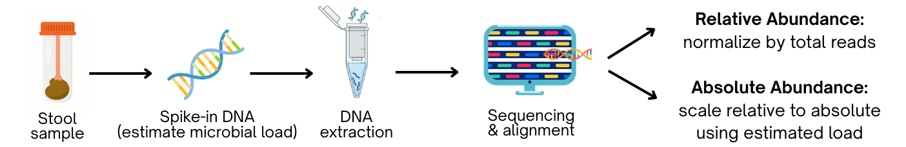
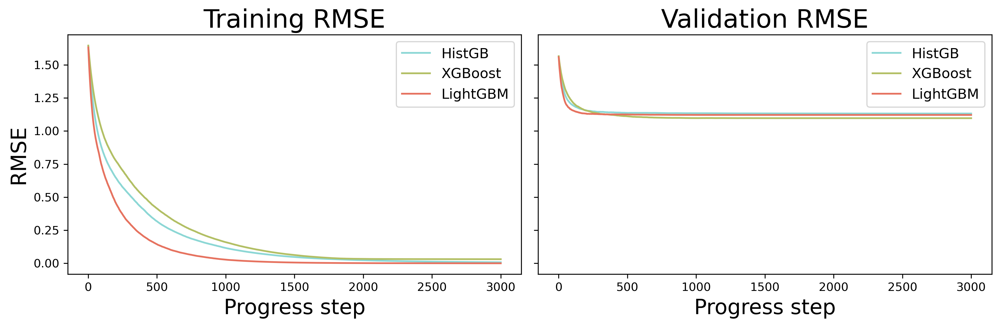
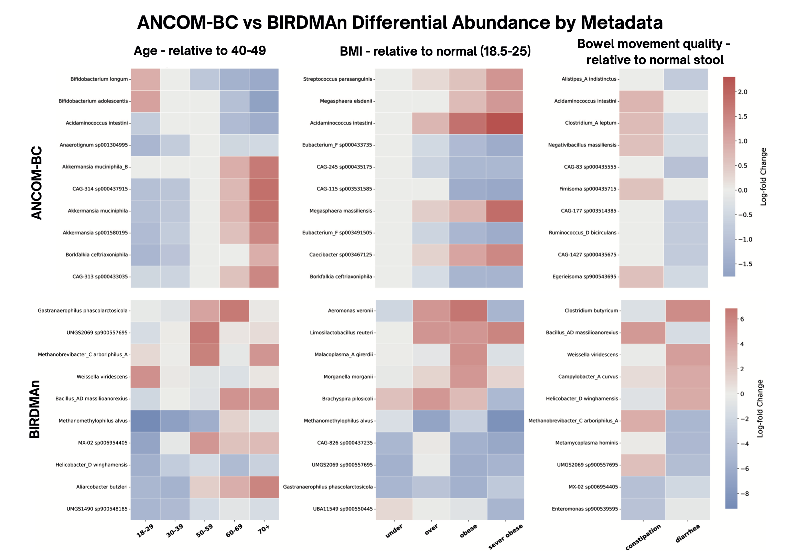
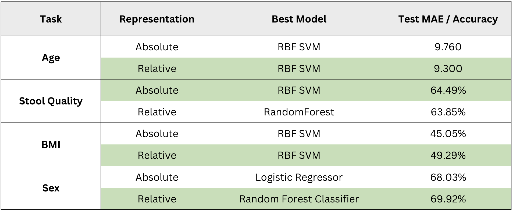

  <a class="header-btn" href="https://github.com/mwdai049/Microbial-Abundances-Predictions-on-EHR-and-Transformability" target="_blank">View Code</a>
  <a class="header-btn" href="https://drive.google.com/file/d/13E0J8UGHHeai270ouIiKM89FnBLRY9Mr/view" target="_blank">View Report</a>
  <a class="header-btn" href="https://drive.google.com/file/d/1D5aO0L8WfDuxJiMZauNXtHue4Ejxcr7y/view?usp=sharing" target="_blank">View Poster</a>

<a href="#problem">Problem</a>
<a href="#data">Data</a>
<a href="#method">Method</a>
<a href="#results">Results</a>
<a href="#discussion">Discussion</a>
<a href="#references">References</a>

## Problem

The gut microbiome plays an important role in human health, and microbial composition has been linked to conditions such as inflammatory bowel disease, Parkinson’s disease, Alzheimer’s disease, and autism spectrum disorder.

Most microbiome datasets contain only **relative abundances**, where the sample is measured as composition. The sums of each taxa in a sample must add up to one, meaning that when the count of one taxa increases, the count of another must decrease. 

In contrast, **absolute abundance** data contains the true count of taxa present per sample. However, the process for obtaining this data is far more expensive and labor-intensive.

  

Thus, our project had two ultimate goals:
1. Evaluate whether absolute abundance data can provide more insights into the gut microbiome.
2. Find a method of constructing absolute abundance data from relative abundance to perform new analyses and save money on an expensive lab procedure.

### Objectives
We conducted the following analyses:
1. use differential abundance techniques (ANCOM-BC and BIRDMAn) to identify shared biological signals and specify distinctions between the methods,
2. build baseline supervised machine learning models that can predict host metadata variables like age, body mass index (BMI), stool quality (Bristol Stool Scale), and related phenotypes,
3. and model absolute abundance using relative abundance data, producing synthetic absolute abundance datasets.

Once we develop the relative → absolute abundance model, we would conduct further analysis to compare the performance of true versus predicted absolute abundance tables. This includes attempting to reproduce the results in parts a) and b) of the project.

---

## Data

Our dataset contains paired microbiome feature tables and limited host metadata.

### Inputs
- **Metadata:** age, body mass index (BMI), sex, bowel movement type, and related host variables
- **Relative abundance table:** sample-by-feature table based on sequencing-derived counts
- **Absolute abundance table:** sample-by-feature table estimating true microbial quantity per unit sample

### Preprocessing
- Both tables were filtered using **Microbiome Coverage (micov)** at a 30% threshold
- Samples, metadata, and feature tables were aligned by sample ID
- Blanks and controls were removed
- Key metadata variables were cleaned before analysis

### Why this matters
Relative abundance data is much easier to collect, but absolute abundance better reflects the true quantity of microbes. This project evaluates whether relative abundance can be used to recover similar biological conclusions and approximate absolute measurements.

---

## Method

Our methodology consists of three major components.

---

### 1. Differential Abundance Analysis

We used two complementary frameworks to identify taxa enriched or depleted across host phenotype groups. **ANCOM-BC** was run via QIIME2, fitting a multifactor model with age, BMI, sex, and bowel movement as covariates; results were summarized at the genus level using log fold changes and FDR-adjusted q-values. **BIRDMAn** was run in parallel at the species level using a Bayesian hierarchical negative binomial model, and credible intervals on log fold changes were used to evaluate features of interest. We also ran a multifactor PERMANOVA on Bray–Curtis distances to contextualize taxon-level signals at the whole-community level.

To evaluate signal preservation, we applied the same ANCOM-BC pipeline to the true absolute abundance table and to the estimated absolute abundance table (relative abundance scaled by predicted total microbial load), comparing effect directions across both representations.

### 2. Predictive Modeling

We build baseline supervised learning models to predict host metadata variables from microbiome features, including:
- age
- body mass index (BMI)
- sex
- bowel movement (stool quality)

This helps us compare how relative and absolute abundance representations perform in downstream prediction tasks.

#### Dataset Preparation

The dataset was split into:

- **60% training**
- **20% validation**
- **20% test**

Where the training set was used for model fitting, the validation set for hyperparameter tuning and model selection, and the test set for final performance evaluation.

We also manually balanced the training set so that each class was represented equally, e.g. for sex we made sure there were an equal number of 'female' and 'male' samples. 

#### Feature Preprocessing

Only microbial taxa features were used as model inputs.

For the BMI and bowel movement predictive tasks, we removed extremely sparse taxa by applying a **40% prevalence filter** using the training set. This threshold was selected after evaluating several candidate thresholds (0.1–0.5) and choosing the one that produced the best validation performance. Selected features were then applied consistently to the validation and test sets.

To reduce skewness in microbiome abundance data, both absolute and relative abundance values were transformed using log(x + 1). 

We used a OneHotEncoder to encode the sex, BMI, and bowel movement quality metadata features. 

#### Prediction Tasks

We evaluated four prediction tasks using microbiome features:

- **Age** (regression)
- **Sex** (classification)
- **BMI** (regression and classification)
- **Bowel movement** (classification)

#### Models

We trained several commonly used machine learning models for high-dimensional biological data:

- **Random Forest**
- **Gradient Boosted Regression** (for age prediction)
- **HistGradientBoosting**
- **Support Vector Machine (RBF kernel)**
- **Logistic Regression** (for sex classification)

Random Forest and Gradient Boosted regression models used fixed hyperparameters, while **HistGradientBoosting and SVM models were tuned using GridSearchCV**.

#### Evaluation

Model performance was evaluated using metrics appropriate for each task.

Regression tasks (Age, BMI):

- **Mean Absolute Error (MAE)**
- **R²**

Classification tasks (Sex, BMI category, Bowel movement):

- **Accuracy**
- **Macro-F1**
- **Weighted-F1**
- **ROC-AUC**

Baseline models (mean prediction or majority class) were used for comparison.

#### Statistical Comparison

To compare models trained on **absolute vs relative abundance**, we used **bootstrap resampling (10,000 iterations)** to estimate confidence intervals and test whether performance differences were statistically significant.

#### Model Interpretation

We applied **SHAP (SHapley Additive Explanations)** analysis to interpret model predictions and identify microbial taxa that contributed most strongly to each prediction task.

### 3. Modeling Absolute Abundance from Relative Abundance

Our final goal is to estimate absolute abundance using only relative abundance data.

The idea is:

1. use relative abundance features to predict the **total absolute microbial load** for each sample,
2. multiply the predicted total by each feature’s relative proportion,
3. generate a **synthetic absolute abundance table**.

Because total abundance varies widely across samples, we apply a **log(1 + x)** transformation to the prediction target. We experiment with multiple regression approaches, including:
- linear models
- random forest
- gradient boosting

  

---

## Results

### 1. Differential Abundance Analysis

Differential abundance analysis showed that host-associated microbial signals were present in the NPH relative abundance data, but their strength and structure depended on the phenotype being tested.

  

#### Age

**Age** remained the clearest and most consistent differential abundance signal in our analysis. Compared with the other metadata categories, age produced broader and more coherent taxonomic shifts across bins and stood out in both ANCOM-BC and BIRDMAn as the strongest overall phenotype-associated pattern.

At the taxon level, *Bifidobacterium longum* and *Bifidobacterium adolescentis* were relatively enriched in younger age bins and depleted in older ones, while *Akkermansia muciniphila* showed the opposite pattern. These results made age the strongest and most interpretable biological signal in the differential abundance analysis.

#### BMI

**BMI** was also associated with taxonomic differences, but these shifts were weaker and more gradual overall than those observed for age. Across both ANCOM-BC and BIRDMAn, BMI showed detectable signal, but the results were less coherent and less strongly structured across bins.

Overall, the BMI findings suggest that body mass is associated with microbiome variation, though the signal appears more modest and gradual than the age-associated shifts.

#### Bowel Movement Quality

**Bowel movement quality** also showed clear taxon-level contrasts relative to the normal-stool reference group, but unlike age, these effects appeared more localized. At the species level, both ANCOM-BC and BIRDMAn showed visible separation from the reference category, although the two methods did not consistently prioritize the same exact species.

BIRDMAn highlighted taxa such as *Campylobacter curvus* and *Helicobacter winghamensis*, both of which have previously been associated with gastroenteritis or diarrhea-related gut disturbance.

#### Community-Level Interpretation
These taxon-level findings were further contextualized by PERMANOVA, which indicated that age was associated with stronger community-level structure, whereas stool-quality effects were more restricted at the whole-community level. When viewed together with the ANCOM-BC and BIRDMAn results, this pattern suggests that **age** is linked to broader and more coherent microbiome-wide restructuring, **BMI** is associated with weaker and more gradual taxonomic shifts, and **bowel movement quality** primarily affects a more limited set of taxa.

#### True vs. Estimated Absolute Abundance

As a sensitivity check, we also applied ANCOM-BC to the **true absolute abundance** table and to the **estimated absolute abundance** table. The estimated absolute abundance results were very similar to the true absolute abundance results, suggesting that the major host-associated effect directions were largely preserved after transformation.

#### Key Takeaways
Together, these results suggest that the NPH relative abundance data retain meaningful host-associated biological structure, but that the magnitude and coherence of that structure are phenotype-dependent.

### 2. Predictive Modeling

We compare model performance across abundance representations for host phenotype prediction tasks. These results help determine whether absolute abundance provides stronger predictive signal than relative abundance.

#### Age
The best age regression model was an **RBF SVM**. Relative abundance performed slightly better than absolute abundance:

- **Absolute:** test MAE = 9.76, test R² = 0.438  
- **Relative:** test MAE = 9.30, test R² = 0.484  

This improvement was **statistically significant**, but the effect size was modest.

#### Sex
Sex prediction performance was similar across representations. Relative abundance performed slightly better overall, but the difference was **not statistically significant**.

**Absolute:**
- Best model: **Logistic Regressor**
- Test Accuracy = **68.03%**
- Test Macro-F1 = **0.647**
- Macro-AUC = **0.737**

**Relative:**
- Best model: **Random Forest Classifier**
- Test Accuracy = **69.92%**
- Test Macro-F1 = **0.677**
- Macro-AUC = **0.724**

#### BMI
BMI showed the strongest benefit from relative abundance.

**Regression**
- Best model: **Relative-abundance SVM**
- Test MAE = **4.512**
- Test R² = **0.220**

**Classification**
- Best model: **Relative-abundance SVM**
- Test Accuracy = **0.493**
- Test Macro-F1 = **0.390**
- Macro-AUC = **0.705**

These results suggest that microbiome composition contains some BMI-related signal, but predictive power remains moderate.

#### Bowel Movement (Stool Quality)
Bowel movement classification achieved similar results across abundance representations.

- Best test accuracy: **0.645**
- Best macro-F1: **0.397**

Bootstrap comparisons found **no significant difference** between absolute and relative abundance models.

#### Overview

  

**Figure.** Summary of best-performing metadata prediction models across age, sex, BMI, and bowel movement tasks.

### 3. Modeling Absolute Abundance from Relative Abundance

We evaluate the quality of predicted absolute abundance tables by comparing their structure to true absolute abundance profiles. Ordination and downstream analyses help assess how well the synthetic data preserves the original biological relationships.

  

---

## Discussion

More broadly, our work asked two key questions:

- How much biological signal is lost when using only relative abundance?
- Can predicted absolute abundance recover enough signal to support meaningful downstream analysis?

Ultimately, we found that:

- There are consistent trends across metadata variables that can be used for downstream modelling. 
- Models trained on absolute and relative abundance data perform similarly, indicating that there is no significant advantage to using one dataset over the other for predictive tasks. 
- Predicting total microbial load from relative abundance data is possible, although further improvements in model training and raw-space transformations are needed.

Next steps may involve evaluating these approaches on longitudinal datasets and exploring additional prediction targets, such as disease phenotypes.

---

## References

  
Abbott, Sharon L., Michael Waddington, David Lindquist, Jim Ware, Wendy Cheung, Janet Ely, and J. Michael Janda. "Description of <i>Campylobacter curvus</i> and C. curvus-like Strains Associated with Sporadic Episodes of Bloody Gastroenteritis and Brainerd's Diarrhea." <i>Journal of Clinical Microbiology</i> 43, no. 2 (2005): 585–588.

  
Aitchison, John. "The Statistical Analysis of Compositional Data." <i>Journal of the Royal Statistical Society: Series B (Methodological)</i> 44, no. 2 (1982): 139–160.

  
All of Us Research Program Investigators. "The 'All of Us' Research Program." <i>New England Journal of Medicine</i> 381, no. 7 (2019): 668–676.

  
Ames, Nancy J., Alexandra Ranucci, Brad Moriyama, and Gwenyth R. Wallen. "The Human Microbiome and Understanding the 16S rRNA Gene in Translational Nursing Science." <i>Nursing Research</i> 66, no. 2 (2017): 184–197.

  
Anderson, Marti J. "A New Method for Non-Parametric Multivariate Analysis of Variance." <i>Austral Ecology</i> 26, no. 1 (2001): 32–46.

  
Arboleya, Silvia, Claire Watkins, Catherine Stanton, and R. Paul Ross. "Gut Bifidobacteria Populations in Human Health and Aging." <i>Frontiers in Microbiology</i> 7 (2016): 1204.

  
Bolyen, Evan, Jai Ram Rideout, Matthew R. Dillon, Nicholas A. Bokulich, Christian C. Abnet, Gabriel A. Al-Ghalith, Harriet Alexander, et al. "Reproducible, Interactive, Scalable and Extensible Microbiome Data Science Using QIIME 2." <i>Nature Biotechnology</i> 37, no. 8 (2019): 852–857.

  
DeWeerdt, Sarah. "Parkinson's Gut-Microbiota Links Raise Treatment Possibilities." <i>Nature</i> (2025).

  
Fernandes, Andrew D., Jennifer Ns Reid, Jean M. Macklaim, Thomas A. McMurrough, David R. Edgell, and Gregory B. Gloor. "Unifying the Analysis of High-Throughput Sequencing Datasets: Characterizing RNA-seq, 16S rRNA Gene Sequencing and Selective Growth Experiments by Compositional Data Analysis." <i>Microbiome</i> 2, no. 1 (2014): 15.

  
Forry, Samuel P., Stephanie L. Servetas, Jason G. Kralj, Keng Soh, Michalis Hadjithomas, Raul Cano, Martha Carlin, et al. "Variability and Bias in Microbiome Metagenomic Sequencing: An Interlaboratory Study Comparing Experimental Protocols." <i>Scientific Reports</i> 14, no. 1 (2024): 9785.

  
Gloor, Gregory B., Jean M. Macklaim, Vera Pawlowsky-Glahn, and Juan J. Egozcue. "Microbiome Datasets Are Compositional: And This Is Not Optional." <i>Frontiers in Microbiology</i> 8 (2017): 2224.

  
Huang, Shi, Niina Haiminen, Anna-Paola Carrieri, Rebecca Hu, Lingjing Jiang, Laxmi Parida, Baylee Russell, et al. "Human Skin, Oral, and Gut Microbiomes Predict Chronological Age." <i>mSystems</i> 5, no. 1 (2020): 10–1128.

  
Knight, Rob, Alison Vrbanac, Bryn C. Taylor, Alexander Aksenov, Chris Callewaert, Justine Debelius, Antonio Gonzalez, et al. "Best Practices for Analysing Microbiomes." <i>Nature Reviews Microbiology</i> 16, no. 7 (2018): 410–422.

  
Knights, Dan, Laura Wegener Parfrey, Jesse Zaneveld, Catherine Lozupone, and Rob Knight. "Human-Associated Microbial Signatures: Examining Their Predictive Value." <i>Cell Host &amp; Microbe</i> 10, no. 4 (2011): 292–296.

  
Lin, Huang, and Shyamal Das Peddada. "Analysis of Compositions of Microbiomes with Bias Correction." <i>Nature Communications</i> 11, no. 1 (2020): 3514.

  
Lovell, David, Vera Pawlowsky-Glahn, Juan José Egozcue, Samuel Marguerat, and Jürg Bähler. "Proportionality: A Valid Alternative to Correlation for Relative Data." <i>PLoS Computational Biology</i> 11, no. 3 (2015): e1004075.

  
McArdle, Brian H., and Marti J. Anderson. "Fitting Multivariate Models to Community Data: A Comment on Distance-Based Redundancy Analysis." <i>Ecology</i> 82, no. 1 (2001): 290–297.

  
McDonald, Daniel, Embriette Hyde, Justine W. Debelius, James T. Morton, Antonio Gonzalez, Gail Ackermann, Alexander A. Aksenov, et al. "American Gut: An Open Platform for Citizen Science Microbiome Research." <i>mSystems</i> 3, no. 3 (2018): 10–1128.

  
Melito, P. L., C. Munro, P. R. Chipman, D. L. Woodward, T. F. Booth, and F. G. Rodgers. "<i>Helicobacter winghamensis</i> sp. nov., a Novel <i>Helicobacter</i> sp. Isolated from Patients with Gastroenteritis." <i>Journal of Clinical Microbiology</i> 39, no. 7 (2001): 2412–2417.

  
Miller, Don M. "Reducing Transformation Bias in Curve Fitting." <i>The American Statistician</i> 38, no. 2 (1984): 124–126.

  
Morton, James T., Clarisse Marotz, Alex Washburne, Justin Silverman, Livia S. Zaramela, Anna Edlund, Karsten Zengler, and Rob Knight. "Establishing Microbial Composition Measurement Standards with Reference Frames." <i>Nature Communications</i> 10, no. 1 (2019): 2719.

  
National Institutes of Health. "Nutrition for Precision Health, Powered by the All of Us Research Program." 2021.

  
Nearing, Jacob T., Gavin M. Douglas, Molly G. Hayes, Jocelyn MacDonald, Dhwani K. Desai, Nicole Allward, Casey M. A. Jones, et al. "Microbiome Differential Abundance Methods Produce Different Results Across 38 Datasets." <i>Nature Communications</i> 13, no. 1 (2022): 342.

  
Pasolli, Edoardo, Duy Tin Truong, Faizan Malik, Levi Waldron, and Nicola Segata. "Machine Learning Meta-Analysis of Large Metagenomic Datasets: Tools and Biological Insights." <i>PLoS Computational Biology</i> 12, no. 7 (2016): e1004977.

  
Props, Ruben, Frederiek-Maarten Kerckhof, Peter Rubbens, Jo De Vrieze, Emma Hernandez Sanabria, Willem Waegeman, Pieter Monsieurs, Frederik Hammes, and Nico Boon. "Absolute Quantification of Microbial Taxon Abundances." <i>The ISME Journal</i> 11, no. 2 (2017): 584–587.

  
Rahman, Gibraan, James T. Morton, Cameron Martino, Gregory D. Sepich-Poore, Celeste Allaband, Caitlin Guccione, Yang Chen, Daniel Hakim, Mehrbod Estaki, and Rob Knight. "BIRDMAn: A Bayesian Differential Abundance Framework That Enables Robust Inference of Host-Microbe Associations." <i>BioRxiv</i> (2023).

  
Thomas, Andrew Maltez, Paolo Manghi, Francesco Asnicar, Edoardo Pasolli, Federica Armanini, Moreno Zolfo, Francesco Beghini, et al. "Metagenomic Analysis of Colorectal Cancer Datasets Identifies Cross-Cohort Microbial Diagnostic Signatures and a Link with Choline Degradation." <i>Nature Medicine</i> 25, no. 4 (2019): 667–678.

  
The Human Microbiome Project Consortium. "Structure, Function and Diversity of the Healthy Human Microbiome." <i>Nature</i> 486, no. 7402 (2012): 207–214.

  
Tkacz, Andrzej, Marion Hortala, and Philip S. Poole. "Absolute Quantitation of Microbiota Abundance in Environmental Samples." <i>Microbiome</i> 6, no. 1 (2018): 110.

  
Turnbaugh, Peter J., Micah Hamady, Tanya Yatsunenko, Brandi L. Cantarel, Alexis Duncan, Ruth E. Ley, Mitchell L. Sogin, et al. "A Core Gut Microbiome in Obese and Lean Twins." <i>Nature</i> 457, no. 7228 (2009): 480–484.

  
Vandeputte, Doris, Gunter Kathagen, Kevin D'hoe, Sara Vieira-Silva, Mireia Valles-Colomer, João Sabino, Jun Wang, et al. "Quantitative Microbiome Profiling Links Gut Community Variation to Microbial Load." <i>Nature</i> 551, no. 7681 (2017): 507–511.

  
Vandesompele, Jo, Katleen De Preter, Filip Pattyn, Bruce Poppe, Nadine Van Roy, Anne De Paepe, and Frank Speleman. "Accurate Normalization of Real-Time Quantitative RT-PCR Data by Geometric Averaging of Multiple Internal Control Genes." <i>Genome Biology</i> 3, no. 7 (2002): research0034–1.

  
Zaramela, L. S., M. Tjuanta, O. Moyne, M. Neal, and K. Zengler. "SynDNA—A Synthetic DNA Spike-In Method for Absolute Quantification of Shotgun Metagenomic Sequencing." <i>mSystems</i> 7 (2022): e0044722.

  
Zeng, Shi-Yu, Yi-Fu Liu, Jiang-Hua Liu, Zhao-Lin Zeng, and Hui Xie. "Potential Effects of <i>Akkermansia muciniphila</i> in Aging and Aging-Related Diseases: Current Evidence and Perspectives." <i>Aging and Disease</i> 14, no. 6 (2023): 2015.

